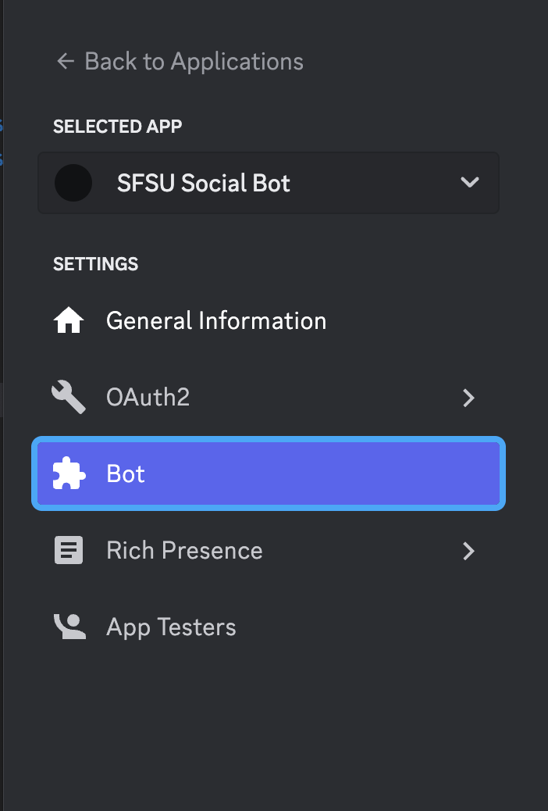

# Social-SFSU-Discord-Bot

## Development Setup

#### Getting the API Token

First we need to get a token that we can use to access the api.

1. Go to `https://discord.com/developers/applications` and inside there, create a bot. If you can do that skip to "Setting Up The Node Project.
2. Go to `https://discord.com/developers/docs/getting-started`
3. Follow along until you get to the section called 'Running Your App.`
4. At that point, stop. We just want the token that is available after the bot is created. The token will be in the section labeled Bot:

5. Now put that token aside and do not lose it.

### Setting Up the Node Project

1. Clone this repo with ssh
   `git clone git@github.com:AlexHappyCode/Social-SFSU-Discord-Bot.git`
   or https
   `git clone https://github.com/AlexHappyCode/Social-SFSU-Discord-Bot.git`

2. cd into the folder 'Social-SFSU-Discord-Bot and once inside, run `npm install` to install the dependencies
3. Create an empty text file called `.env` inside the root of the project.
4. Inside the file write a single line
   ` TOKEN="Token here without quotes"`
5. Now type `npm run dev` The bot should up and running now if you see a messaged that says logged in, inside the console.
